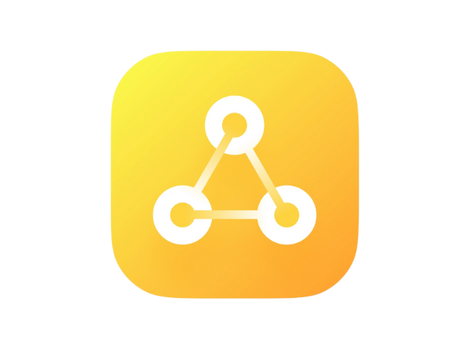

<p align="center">

</p>
<h1 align="center">
  PROJECT-CONNECT
</h1>

<p align="center">
  Be sure to ⭐ this repo so you can keep up to date on any daily progress!
</p>

<p align="center">
<a href="https://github.com/Abhijith14/PROJECT-CONNECT-v1/" target="_blank">
    
</a>&nbsp;
<a href="https://www.python.org/" target="_blank">
    
</a>&nbsp;
<a href="https://github.com/Abhijith14/PROJECT-CONNECT-v1" target="_blank">
    
</a>&nbsp;

</p>

<br>

## ⚡️ Quick start

First of all, download and install [Python](https://www.python.org/downloads/) and your favourite IDE (I used [PyCharm](https://www.jetbrains.com/pycharm/download/#section=windows)). Python Version `3.6` or higher is required.

<br>

### 💻 Run Project CONNECT

- This project works with *Windows Networking*. Connect your devices and make sure you can access the *Public* folder of the devices.
- Move the [main.py](main.py) file to the computer where you will do *Copy Action*.
- Move the [receive.py](receive.py) file to different computers where you need the copied text into the clipboard.
- Finally create a folder inside the *Public* folder and name it;
```bash
PROJECT CONNECT
```
When you copy something; the [main.py](main.py) will create a *.txt* file with this copied content inside PROJECT CONNECT folder. The [receive.py](receive.py) will continuosly scan this folder and move any text to the device clipboard.

<br>

Start [main.py](main.py) in the main computer.
```bash
python main.py
```
Start [receive.py](receive.py) in the remaining computers that are connected to the network.
```bash
python receive.py
```
> 🔔 Please note: This project uses several `windows OS` packages. Therefore this project works only in windows computers. In Future, other OS compatibility will be added.

<br>


## ⭐️ Project assistance

If you want to say **thank you** or/and support active development of `Project CONNECT`:

- Add a [GitHub Star](https://github.com/Abhijith14/PROJECT-CONNECT-v1) to the project.
- Write interesting articles about project on [Dev.to](https://dev.to/), [Medium](https://medium.com/) or personal blog.

Together, we can make this project **better** every day! 😘

<br>

### 🛠️ Built With

* [Python 3.8](https://www.python.org/) - Creating Project


### ❤️ Authors

* **Abhijith Udayakumar** - *Design & Development* - [Abhijith14](https://github.com/Abhijith14)

<br>
<br>

## 🚨 Forking this repo (please read!)

_**yes, with attribution**_.

I value keeping my work open source, but as you all know, _**plagiarism is bad**_. It's always disheartening whenever I find that someone has copied my work without giving me credit. I spent a non-trivial amount of effort building and designing this project, and I am proud of it! All I ask of you all is to not claim this effort as your own.


### TL;DR

Yes, you can fork this repo. Please give me proper credit by linking back to [Abhijith14/PROJECT-CONNECT-v1](https://github.com/Abhijith14/PROJECT-CONNECT-v1). Thanks!
